# girasol

app gratuita de salud para apple watch, en español e inglés, hecha para vivir en la muñeca: sol, agua, comida, cuerpo, respiración y juegos que se juegan moviendo el reloj. sin cuenta, sin anuncios, sin suscripción.

<p align="center">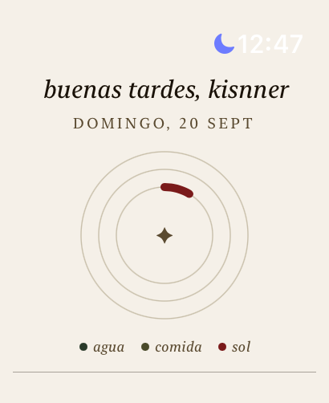</p>
<p align="center"><sub>capturas reales de un apple watch ultra 2</sub></p>

## por qué usarla

- **todo en una pantalla, sin abrir el iphone.** sol, agua, calorías y pulso en tres anillos al abrir la app.
- **te dice si puedes salir, no solo el número.** el índice uv se traduce a un consejo: cuánto tiempo aguantas al sol según tu piel y tu protector, y a qué hora baja.
- **privada por diseño.** tus datos de salud se quedan en tu reloj y en la app Salud. lo único que sale es tu ubicación redondeada a 2 decimales, para pedir el clima.
- **gratis y de código abierto.** no hay servidor, no hay cuenta, no hay nada que vender.
- **en español e inglés**, con selector de idioma dentro de la app (sigue al del reloj por defecto).
- **diseñada para el reloj.** corona para ajustar cantidades, doble toque para confirmar, háptico en cada acción, fondo papel y letra serif que se leen al sol.

## qué ofrece

### sol
- índice uv ahora y curva del día, con la hora del pico y el tramo de riesgo.
- exposición acumulada según tu tipo de piel y el protector que llevas, usando los minutos al aire libre que mide el reloj.
- aviso "protector / sombra / puedes salir", temperatura y sensación de calor.
- alertas locales cuando te acercas a tu límite.
- recordatorio de reaplicar protector: un temporizador de 2 h que arranca solo cuando el consejo pide protector y llevas más de 15 min al aire libre, o cuando pulsas "me puse protector".

<table><tr><td align="center">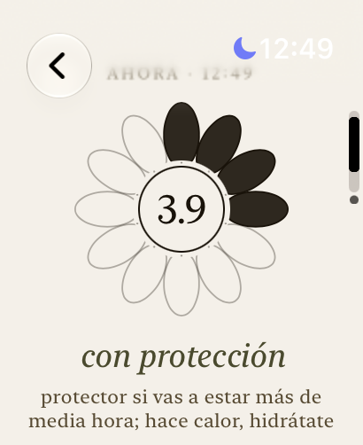<br><sub>uv ahora</sub></td><td align="center">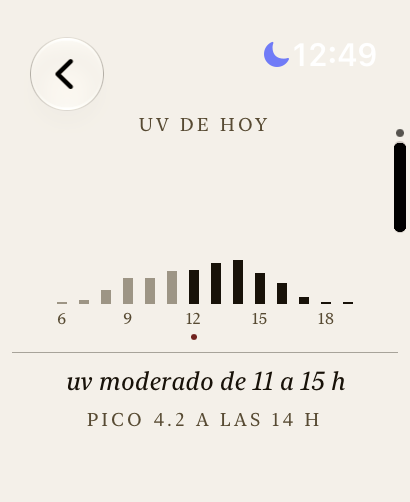<br><sub>uv de hoy</sub></td><td align="center">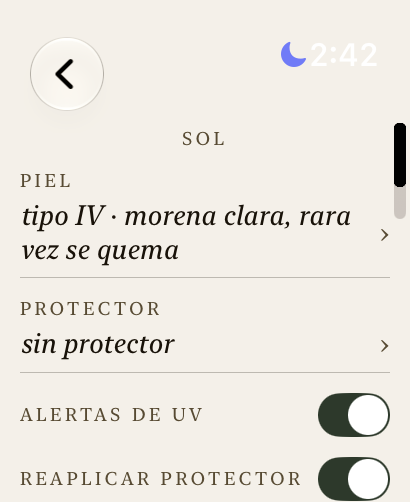<br><sub>piel, protector y alertas</sub></td></tr></table>

### en la esfera
- complicaciones de uv (con la hora del pico), agua y calorías restantes, en los cuatro formatos de la esfera. el uv se recalcula solo cada 30 min con la curva del día guardada.

### agua
- vasos o mililitros con la corona, deshacer el último, meta sugerida según tu peso.
- recordatorios durante el día que solo avisan si aún no llegas a tu meta.
- intent para el botón de acción: un toque y suma un vaso.

<table><tr><td align="center"><br><sub>agua</sub></td></tr></table>

### comida
- meta de calorías calculada con tu perfil (Mifflin-St Jeor), opcionalmente sumando tu actividad.
- registro rápido y deshacer; se guarda en Salud.

<table><tr><td align="center">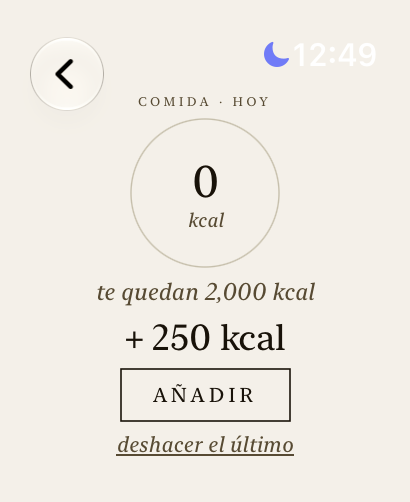<br><sub>comida</sub></td></tr></table>

### racha
- días seguidos cumpliendo agua, pasos y sol dentro de tu límite, con la vista de los últimos 7 días y tu mejor racha.

<table><tr><td align="center">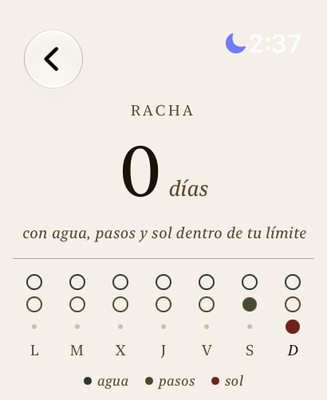<br><sub>racha de 7 días</sub></td></tr></table>

### cuerpo
- pasos, pulso actual y en reposo, con contexto.
- oxígeno en sangre de Salud (apple no permite que apps de terceros inicien la medición; se lee la última).

<table><tr><td align="center">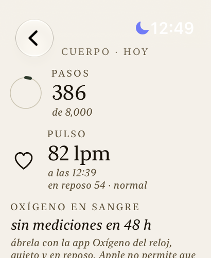<br><sub>pasos, pulso y oxígeno</sub></td></tr></table>

### sueño
- las horas que dormiste anoche y de la última semana (de Salud), y cómo cambian tu agua y tus pasos los días que duermes 7 h o más. es una comparación, no una causa.

<table><tr><td align="center">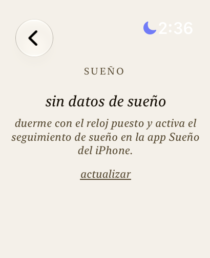<br><sub>sueño</sub></td></tr></table>

### respirar
- sesiones guiadas (calma, caja, dormir) con háptico que marca cada fase, en segundo plano. se registran como minutos de atención plena.

<table><tr><td align="center">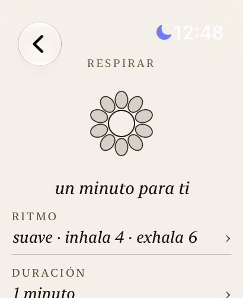<br><sub>respirar</sub></td></tr></table>

### juegos de muñeca
- baloncesto, dardos, pistola (láser o pólvora) y tenis, controlados con los sensores de movimiento: lanzas, apuntas inclinando la muñeca y disparas con un tirón.
- la partida sigue corriendo aunque bajes la muñeca: usa una sesión de entrenamiento para mantener la app viva y los sensores activos (no guarda ningún entrenamiento en Salud).
- pensados para jugar sin mirar: cada resultado tiene su sonido y su patrón de háptico (swish, canasta, rebote, fallo corto o largo), y al volver a mirar la pantalla ves un resumen de lo que pasó.
- sonidos sintetizados en tiempo real y háptico en cada golpe. calibración de puntería y fuerza, sensibilidad ajustable y modo táctil de respaldo.
- pompas para relajarte.

<table><tr><td align="center"><br><sub>juegos</sub></td><td align="center">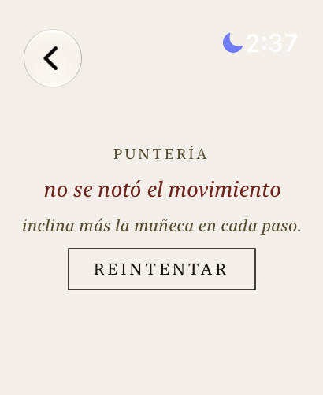<br><sub>calibrar la puntería</sub></td><td align="center">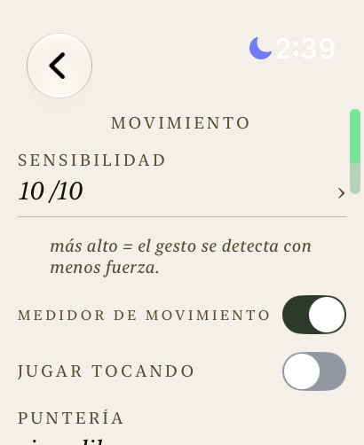<br><sub>sensibilidad y modo táctil</sub></td></tr></table>

### ajustes
- perfil, metas, recordatorios, sol, apariencia (idioma, tema, unidades, háptico) y movimiento, todo desde el reloj.

<table><tr><td align="center">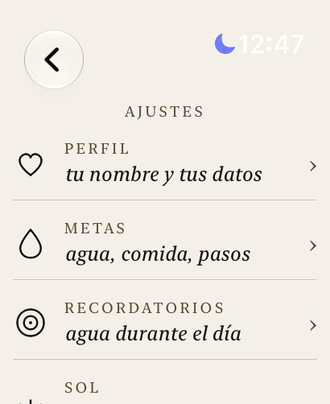<br><sub>ajustes</sub></td><td align="center">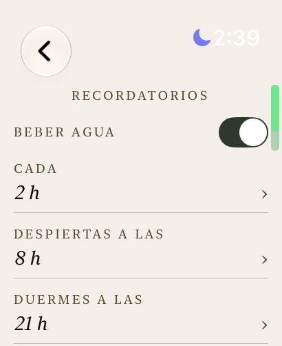<br><sub>recordatorios de agua</sub></td><td align="center">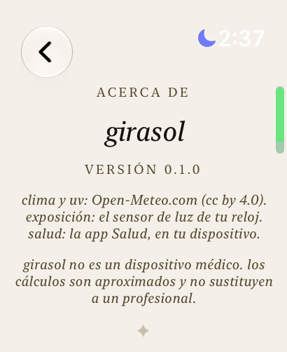<br><sub>acerca de</sub></td></tr></table>

## instalar en tu reloj

necesitas un mac con xcode, un apple watch y una cuenta de apple (la gratuita sirve).

```bash
brew install xcodegen
xcodegen generate
TEAM_ID=TU_TEAM_ID ./scripts/install-watch.sh
```

tu team id está en xcode > settings > accounts. con la cuenta gratuita el perfil dura 7 días: vuelve a correr el script para renovarlo. no hace falta simulador.

## límites, con honestidad

- las complicaciones comparten datos con la app por el llavero, porque las cuentas gratuitas de apple no pueden usar app groups. el agua y las calorías se actualizan cuando abres la app o registras algo; el uv sigue la curva guardada hasta la próxima vez que abras la app.
- no es un dispositivo médico; los cálculos de uv y calorías son aproximados.
- al girar la muñeca para lanzar, watchOS puede apagar o atenuar la pantalla y todavía no hay forma confirmada de evitarlo (el video en bucle no funcionó). los juegos siguen corriendo y avisan con sonido y háptico, pero puede que no veas el resultado en ese instante. si el gesto no se detecta bien, ajusta la sensibilidad en ajustes > movimiento.
- requiere watchOS 27 / xcode 27 (beta al momento de escribir esto).

## pruebas

la lógica (uv, exposición, hidratación, nutrición, motor de los juegos) vive en paquetes swift sin interfaz y se prueba con `swift test`.

## datos

clima y uv: [Open-Meteo](https://open-meteo.com) (CC BY 4.0).

licencia MIT.
