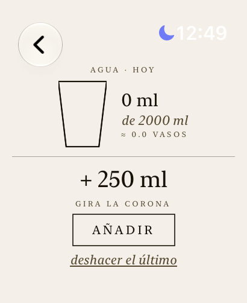
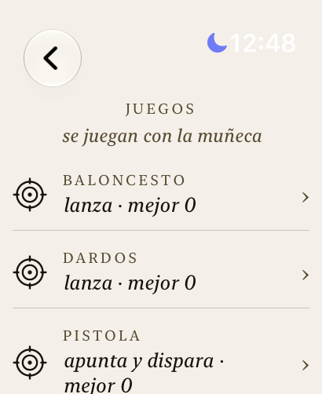

# girasol

app gratuita de salud para apple watch, hecha para vivir en la muñeca: sol, agua, comida, cuerpo, respiración y juegos que se juegan moviendo el reloj. sin cuenta, sin anuncios, sin suscripción.

<p>
  
  
  
  
</p>
<p>
  
  
  
  
</p>
<p>
  
</p>

capturas reales de un apple watch ultra 2.

## por qué usarla

- **todo en una pantalla, sin abrir el iphone.** sol, agua, calorías y pulso en tres anillos al abrir la app.
- **te dice si puedes salir, no solo el número.** el índice uv se traduce a un consejo: cuánto tiempo aguantas al sol según tu piel y tu protector, y a qué hora baja.
- **privada por diseño.** tus datos de salud se quedan en tu reloj y en la app Salud. lo único que sale es tu ubicación redondeada a 2 decimales, para pedir el clima.
- **gratis y de código abierto.** no hay servidor, no hay cuenta, no hay nada que vender.
- **diseñada para el reloj.** corona para ajustar cantidades, doble toque para confirmar, háptico en cada acción, fondo papel y letra serif que se leen al sol.

## qué ofrece

**sol**
- índice uv ahora y curva del día, con la hora del pico y el tramo de riesgo.
- exposición acumulada según tu tipo de piel y el protector que llevas, usando los minutos al aire libre que mide el reloj.
- aviso "protector / sombra / puedes salir", temperatura y sensación de calor.
- alertas locales cuando te acercas a tu límite.

**agua**
- vasos o mililitros con la corona, deshacer el último, meta sugerida según tu peso.
- recordatorios durante el día que solo avisan si aún no llegas a tu meta.
- intent para el botón de acción: un toque y suma un vaso.

**comida**
- meta de calorías calculada con tu perfil (Mifflin-St Jeor), opcionalmente sumando tu actividad.
- registro rápido y deshacer; se guarda en Salud.

**cuerpo**
- pasos, pulso actual y en reposo, con contexto.
- oxígeno en sangre de Salud (apple no permite que apps de terceros inicien la medición; se lee la última).

**respirar**
- sesiones guiadas (calma, caja, dormir) con háptico que marca cada fase, en segundo plano. se registran como minutos de atención plena.

**juegos de muñeca**
- baloncesto, dardos, pistola (láser o pólvora) y tenis, controlados con los sensores de movimiento: lanzas, apuntas inclinando la muñeca y disparas con un tirón.
- la partida sigue corriendo aunque bajes la muñeca: usa una sesión de entrenamiento para mantener la app viva y los sensores activos (no guarda ningún entrenamiento en Salud).
- sonidos sintetizados en tiempo real y háptico en cada golpe. calibración de puntería y fuerza, sensibilidad ajustable y modo táctil de respaldo.
- pompas para relajarte.

## instalar en tu reloj

necesitas un mac con xcode, un apple watch y una cuenta de apple (la gratuita sirve).

```bash
brew install xcodegen
xcodegen generate
TEAM_ID=TU_TEAM_ID ./scripts/install-watch.sh
```

tu team id está en xcode > settings > accounts. con la cuenta gratuita el perfil dura 7 días: vuelve a correr el script para renovarlo. no hace falta simulador.

## límites, con honestidad

- no es un dispositivo médico; los cálculos de uv y calorías son aproximados.
- al girar la muñeca para lanzar, watchOS puede apagar o atenuar la pantalla y todavía no hay forma confirmada de evitarlo (el video en bucle no funcionó). los juegos siguen corriendo y avisan con sonido y háptico, pero puede que no veas el resultado en ese instante. si el gesto no se detecta bien, ajusta la sensibilidad en ajustes > movimiento.
- requiere watchOS 27 / xcode 27 (beta al momento de escribir esto).

## pruebas

la lógica (uv, exposición, hidratación, nutrición, motor de los juegos) vive en paquetes swift sin interfaz y se prueba con `swift test`.

## datos

clima y uv: [Open-Meteo](https://open-meteo.com) (CC BY 4.0).

licencia MIT.
